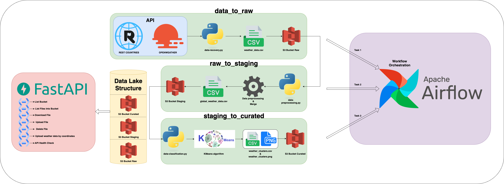

# Data Lake Project

## Project Overview

In a world where access to precise weather data is essential for numerous applications, this project aims to centralize and structure such information using a Data Lake. By leveraging the Rest Countries and OpenWeather APIs, it retrieves weather data for every capital city around the globe.

The architecture is built on a comprehensive process of data ingestion, transformation, and exposure, ensuring efficient storage and availability via a dedicated API. This project exemplifies a modern approach to data management and valorization, combining large-scale ingestion, structured processing, and optimized exposure for various analytical and decision-making applications.

---

## Video

Check the video presentation of the project 

---

## Main Technologies Used

- **Python** ([python.org](https://www.python.org/))  
  A programming and development language that is well-suited for this project.

- **Docker** ([docker.com](https://www.docker.com/))  
  Used for containerizing the project, including both the environment and its services.

- **LocalStack** ([localstack.cloud](https://www.localstack.cloud/))  
  Simulates a Data Lake with different layers—raw, staging, and curated—structured as S3 buckets.

- **Apache Airflow** ([airflow.apache.org](https://airflow.apache.org/))  
  Orchestrates the workflow through Directed Acyclic Graphs (DAGs).

- **FastAPI** ([fastapi.tiangolo.com](https://fastapi.tiangolo.com/))  
  Creates an API that enables interaction with the Data Lake.

---

## Project Architecture 
### General Architecture


### Coding Architecture
```markdown
├── build                 # Directory containing build-related artifacts
│   └── reqs.txt          # Python dependencies
├── dags                  # Directory for Airflow DAG definitions
│   └── openweather_data_lake.py # Airflow DAG for the OpenWeather data pipeline
├── data_analysis         # Directory for data analysis tasks
│   └── data-exploration.ipynb # Jupyter Notebook for data exploration
├── frontend              # Directory for frontend assets
│   ├── index.html        # Main HTML file
│   ├── scripts.js        # JavaScript file
│   └── styles.css        # CSS file
├── logs                  # Directory for Airflow logs
├── src                   # Directory containing source code
│   ├── logs              # Logs of potential errors
│   ├── api.py            # API logic
│   ├── data-classification.py  # Staging layer to Curated layer
│   ├── data-preprocessing.py   # Raw layer to Staging layer
│   └── data-recovery.py        # Data to Raw layer
├── .gitignore            # Git ignore configuration
├── docker-compose.yml    # Docker Compose configuration
├── dockerfile            # Docker build configuration
└── README.md             # Project documentation
```

---

## How to Use

### Step 1: Launch Docker Desktop
- Open [Docker Desktop](https://www.docker.com/products/docker-desktop/) on your device.

### Step 2: Build the Environment
- Run the following command:
  ```bash
  docker compose build
  ```
- **Expected output:**
  ```plaintext
  ✔ Service airflow-init       Built                                                                                                         
  ✔ Service airflow-webserver  Built                                                                                                         
  ✔ Service airflow-scheduler  Built  
  ```

### Step 3: Launch the Containers in Detached Mode
- Run the following command:
  ```bash
  docker compose up -d
  ```
- **Expected output:**
  ```plaintext
  ✔ postgres Pulled                                                                                                                           
  ✔ localstack Pulled                                                                                                                         
  [+] Running 7/7
  ✔ Network data-lake-network                      Created                                                                                     
  ✔ Volume "data-lake-project_postgres_data"       Created                                                                                    
  ✔ Container localstack-data-lake-project         Started                                                                                     
  ✔ Container postgres-data-lake-project           Started                                                                                     
  ✔ Container airflow-webserver-data-lake-project  Started                                                                                    
  ✔ Container airflow-init-data-lake-project       Started                                                                                    
  ✔ Container airflow-scheduler-data-lake-project  Started 
  ```

### Step 4: Verify That All Services Are Running
- Run the following command to check the status of your containers:
  ```bash
  docker ps
  ```
- Ensure that the following containers are up and running:
  - `airflow-scheduler-data-lake-project`
  - `airflow-webserver-data-lake-project`
  - `postgres-data-lake-project`
  - `localstack-data-lake-project`

### Step 5: Launch Apache Airflow
- Open your web browser and navigate to [http://localhost:8081](http://localhost:8081).
- Log in with:
  - **Username:** airflow
  - **Password:** airflow
- If everything is set up correctly, you should see the DAG named `openweather_data_lake` in the DAG area.

### Step 6: Trigger the `openweather_data_lake` DAG
- Click the trigger button and observe each step of the pipeline as it executes.
- You should see "successful" for each of the following steps:
  - `initialize_buckets`
  - `data_to_raw`
  - `raw_to_staging`
  - `staging_to_curated`
- The DAG is scheduled to run every 6 hours.
- To modify this schedule, either comment out the line or change the schedule time in the DAG area:
  `schedule_interval="0 */6 * * *"`

**Note:** The "Initialize_bucket" step automatically creates the `raw`, `staging`, and `curated` buckets. If the buckets already exist, the code will detect them and will not create new ones. This logic was implemented to simplify the process rather than having to create the three buckets using the AWS CLI.

- **Example output if the buckets are created:**
  ```plaintext
  [INFO] Bucket 'raw' created.
  [INFO] Bucket 'staging' created.
  [INFO] Bucket 'curated' created.
  ```
- **Example output if the buckets already exist:**
  ```plaintext
  [INFO] Bucket 'raw' already exists.
  [INFO] Bucket 'staging' already exists.
  [INFO] Bucket 'curated' already exists.
  ```

### Step 7: Launch the FastAPI to Interact with the Data Lake
- Open a terminal and run:
  ```bash
  uvicorn src.api:app --reload
  ```
- You can now use `curl` commands to interact with the API endpoint:

  1. **List Available Buckets**  
     Retrieve the list of all buckets:
     ```bash
     curl -X GET http://127.0.0.1:8000/buckets
     ```

  2. **List Files in a Bucket**  
     Get the list of files in a specific bucket:
     ```bash
     curl -X GET http://127.0.0.1:8000/files/<bucket_name>
     ```

  3. **Download a File**  
     Download a file from a specific bucket:
     ```bash
     curl -X GET http://127.0.0.1:8000/download/<bucket_name>/<file_name>
     ```

  4. **Upload a File**  
     Upload a file to a specific bucket:
     ```bash
     curl -X POST -F "file=@<file_path>" http://127.0.0.1:8000/upload/<bucket_name>
     ```

  5. **Delete a File**  
     Delete a file from a specific bucket:
     ```bash
     curl -X DELETE http://127.0.0.1:8000/delete/<bucket_name>/<file_name>
     ```

  6. **Upload Weather Data by Coordinates**  
     Upload weather data using geo coordinates:
     ```bash
     curl -X GET "http://localhost:8000/weather?lat=...&lon=..."
     ```

  7. **API Health Check**  
     Verify the API's health status:
     ```bash
     curl -X GET http://127.0.0.1:8000/healthcheck
     ```

### Step 8: Launch the Frontend
- You can interact with the API using a frontend. To launch the frontend, you have several options:
  - Open the `index.html` file directly in your web browser.
  - Use a live server extension to host the `index.html` file on port 5000.
  - Modify the code if you want to map the frontend to a specific port.

---

## Useful Queries

### Check Docker Containers Logs
- **All Containers:**  
  Check logs for all containers:
  ```bash
  docker-compose logs -f
  ```

- **Airflow Scheduler:**  
  Check logs for the Airflow Scheduler:
  ```bash
  docker logs -f airflow-scheduler-data-lake-project
  ```

- **Airflow Webserver:**  
  Check logs for the Airflow Webserver:
  ```bash
  docker logs -f airflow-webserver-data-lake-project
  ```

- **LocalStack:**  
  Check logs for LocalStack:
  ```bash
  docker logs -f localstack-data-lake-project
  ```

*These commands are useful for viewing detailed logs.*

### Creating LocalStack Buckets

1. **Log in to AWS CLI:**
   ```bash
   aws configure
   ```
   Enter the following values when prompted:
   - **AWS Access Key ID:** YOUR_ACCESS_KEY_ID
   - **AWS Secret Access Key:** YOUR_SECRET_ACCESS_KEY
   - **Default region name:** us-east-1
   - **Default output format:** json

2. **Create the Required Buckets:**

   - **Create the `raw` bucket:**
     ```bash
     aws s3api create-bucket --bucket raw --endpoint-url=http://localhost:4566
     ```

   - **Create the `staging` bucket:**
     ```bash
     aws s3api create-bucket --bucket staging --endpoint-url=http://localhost:4566
     ```

   - **Create the `curated` bucket:**
     ```bash
     aws s3api create-bucket --bucket curated --endpoint-url=http://localhost:4566
     ```

*These commands are useful if you want to create the S3 buckets in LocalStack using the AWS CLI.*

### List All S3 Buckets
- Run the following command to list all S3 buckets:
  ```bash
  aws --endpoint-url=http://localhost:4566 s3 ls
  ```
- **Output:**
  ```
  2025-01-25 13:17:59 raw
  2025-01-25 13:17:59 staging
  2025-01-25 13:17:59 curated
  ```

*This command is useful to list all S3 buckets created in LocalStack.*

### Check the Content of Each Bucket

#### Raw Bucket
- List the content of the `raw` bucket:
  ```bash
  aws --endpoint-url=http://localhost:4566 s3 ls s3://raw
  ```
- **Output:**
  ```
  2025-01-25 13:18:01      43038 weather_data_2025-01-25_13-18-01.csv
  ```

#### Staging Bucket
- List the content of the `staging` bucket:
  ```bash
  aws --endpoint-url=http://localhost:4566 s3 ls s3://staging
  ```
- **Output:**
  ```
  2025-01-25 13:20:16     118435 global_weather_data.csv
  ```

#### Curated Bucket
- List the content of the `curated` bucket:
  ```bash
  aws --endpoint-url=http://localhost:4566 s3 ls s3://curated
  ```
- **Output:**
  ```
  2025-01-25 13:20:19     123299 weather_clusters.csv
  2025-01-25 13:20:19     122336 weather_clusters.png
  ```

*These commands are useful to view the contents of each S3 bucket.*
